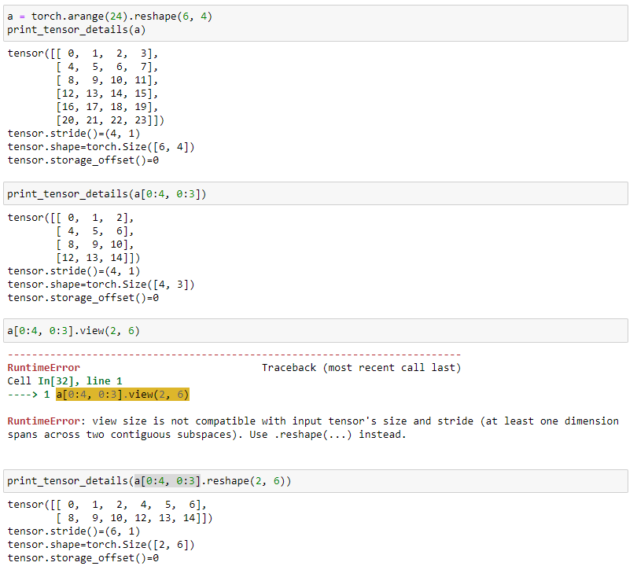

# Everything about strides

## Compute strides during initialization

#### Input:

- `shape`

#### Solution:

$$
\begin{aligned}
\text{Let}&: \\
shape &= [s_1, s_2, ..., s_n] \text{, where } s_i > 0 \\
strides &= [t_1, t_2, ..., t_n] \text{, where } t_i = null \\\\

\text{Then}&: \\
t_i &=
\begin{cases}
  \prod_{j=i+1}^n s_j & i = 1, 2, ..., n-1 \\
  1 & i = n
\end{cases}
\end{aligned}
$$

#### Implementation:

```python
def computeStrides(shape):
  strides = [None] * len(shape)
  strideVal = 1
  for i in range(len(shape) - 1, -1, -1):
    strides[i] = strideVal
    strideVal *= shape[i]
  return strides
```

## A bug in minitensor's reshape

- minitensor's `reshape` doesn't consider the contiguousness of the data,
  attempt to create view for any kind of data
- minitensor's `reshape` is just a `view` operation at this point
- when the data is not contiguous, computing a valid `strides` for the new shape
  is not possible anymore
  - check the image below, a[0:4, 0:3] is a view of a, but a[0:4,
    0:3].reshape(2, 6) is not a view of a anymore because a[0:4, 0:3] is not
    contiguous, and we can't create a view with non-contiguous data
  - try to go through a[0:4, 0:3].reshape(2, 6) using a as the base tensor, you
    will see that the strides of a[0:4, 0:3].reshape(2, 6) are invalid
- `reshape` should be a `view` operation if the data is contiguous, and a `copy`
  operation if the data is not contiguous
  
- Reference:
  - https://pytorch.org/docs/stable/generated/torch.reshape.html
  - https://pytorch.org/docs/stable/generated/torch.Tensor.view.html#torch.Tensor.view
  - https://github.com/cezannec/capsule_net_pytorch/issues/4
  - https://stackoverflow.com/questions/49643225/whats-the-difference-between-reshape-and-view-in-pytorch
  - https://stackoverflow.com/questions/66750391/runtimeerror-view-size-is-not-compatible-with-input-tensors-size-and-stride-a
  - https://numpy.org/doc/stable/glossary.html#term-contiguous
- TODO:
  - implement `view`, fix `reshape`, research way to check contiguousness of a
    data (the unable to create view error mostly happens when trying to create a
    view of view, if the original view is not contiguous)
